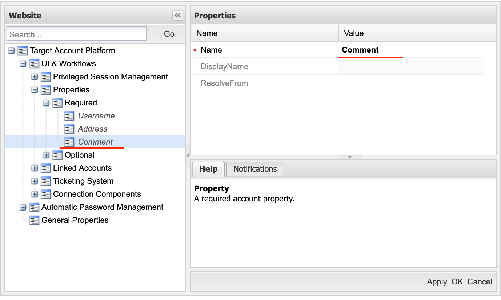

# WebConnect

<div align="center">


**CyberArk Connection Component for Automated Web Authentication**

[](https://dotnet.microsoft.com/download/dotnet/8.0)
[](https://www.microsoft.com/windows)
[](https://www.cyberark.com/)
[](LICENSE)

</div>

## 🚀 Overview

WebConnect is a specialized **CyberArk connection component** designed to provide automated access to web applications through CyberArk's Privileged Session Management (PSM). Unlike traditional connection components that require manual WebFormFields configuration for each target website, WebConnect **automatically detects login fields and verifies login success**, dramatically reducing administrative overhead and saving significant configuration time.

**Please note**
* The whole code was completely written by AI using Cursor.
* Code security is being verified on every change by using Snyk
* It is meant to be a open-source community project, it is not related to CyberArk company anyhow
* Use at own risk, no guarantees
* Feel free to reach out for any questions, concerns and ideas, I am up for discussions

### Key Benefits for CyberArk Administrators

- **🎯 Zero WebFormFields Configuration**: Eliminates the need to manually specify login field selectors for each website
- **🔍 Intelligent Field Detection**: Automatically identifies username, password, and domain fields using advanced algorithms  
- **✅ Automatic Login Verification**: Confirms successful authentication without manual success criteria configuration
- **⏱️ Consistent Timeouts**: All logins complete within 10-30 seconds with proper timeout handling
- **🛡️ Enterprise Security**: Compatible with CyberArk security standards and AppLocker policies
- **📊 Comprehensive Logging**: Detailed audit trails stored in PSM shadow user locations

This connection component **transforms web authentication management** by removing the complexity of custom field mapping, allowing administrators to focus on drinking coffee than technical implementation details.

---

## ✨ Key Features

### Automatic Authentication
- **Smart Field Detection**: Intelligently identifies login form elements without configuration
- **Success Verification**: Automatically determines when login has completed successfully
- **Domain Handling**: Supports both username/password and username/domain/password scenarios
- **Dropdown Support**: Handles username and domain dropdown menus automatically

### CyberArk Integration
- **Seamless PSM Integration**: Works directly with CyberArk's session management infrastructure
- **Credential Injection**: Receives credentials securely from CyberArk Password Vault
- **Session Logging**: All actions are logged through CyberArk's audit framework
- **Shadow User Support**: Operates within PSM shadow user context

1. **Download the latest release**
   - Visit [Releases](https://github.com/MaskoFortwana/CyberArk-WebConnect/releases)
   - Download `WebConnect-X.X.X-win-x64.zip`

---

## 🖥️ System Requirements

### Prerequisites
- **CyberArk Components**: 
  - CyberArk PSM Server (v13.0 or later recommended)
- **Browser Requirements**:
  - Google Chrome (latest stable version)
  - ChromeDriver v136+ (matching Chrome version)
- **Runtime**: .NET 8.0 Runtime (included in deployment, no need to install on PSM server)

### Supported Environments
- **Primary**: CyberArk PSM (Privileged Session Management)
- **Testing**: Standalone testing outside CyberArk environment

---

## 📦 CyberArk Installation & Configuration

### 1. Component Deployment

**Deploy WebConnect to your PSM server in the standard CyberArk components directory

* From the downloaded zip file, copy following files:
 * WebConnect folder -> C:\Program Files (x86)\CyberArk\PSM\Components\
* WebConnect.exe -> C:\Program Files (x86)\CyberArk\PSM\Components\
* WebConnect-Wrapper.exe  -> C:\Program Files (x86)\CyberArk\PSM\Components\ (or build your own exe from au3 script in the zip file. instructions below)

* Add your existing chromedriver to webconnect folder:
	C:\Program Files (x86)\CyberArk\PSM\Components\chromedriver.exe -> C:\Program Files (x86)\CyberArk\PSM\Components\WebConnect\

Folder structure:
```
C:\Program Files (x86)\CyberArk\PSM\Components\
├── WebConnect.exe                    # Main executable
├── WebConnect-Wrapper.exe            # AutoIt wrapper script
├── WebConnect-Wrapper.au3            # AutoIt source
└── WebConnect\                       # Dependencies directory
    ├── *.dll
    └──selenium-manager\
        └── windows\
	        └──selenium-manager.exe

```

### 2. AppLocker Configuration

**Critical**: The following AppLocker rules are **required** for WebConnect to function:

#### EXE Files
```xml
<!-- WebConnect START -->
<Application Name="WebConnect" Type="Exe" Path="C:\Program Files (x86)\CyberArk\PSM\Components\WebConnect.exe" Method="Hash" />
<Application Name="WebConnect-Wrapper" Type="Exe" Path="C:\Program Files (x86)\CyberArk\PSM\Components\WebConnect-Wrapper.exe" Method="Hash" />
<Application Name="WebConnect2" Type="Exe" Path="C:\Program Files (x86)\CyberArk\PSM\Components\WebConnect\WebConnect.exe" Method="Hash" />
<Application Name="ChromeDriver2" Type="Exe" Path="C:\Program Files (x86)\CyberArk\PSM\Components\WebConnect\chromedriver.exe" Method="Hash" />
<Application Name="WebConnect-Manager" Type="Exe" Path="C:\Program Files (x86)\CyberArk\PSM\Components\WebConnect\selenium-manager\windows\selenium-manager.exe" Method="Hash" />
<!-- WebConnect END -->
```

#### DLL Files
```xml
<Libraries Name="WebConnect-DLLs" Type="Dll" Path="C:\Program Files (x86)\CyberArk\PSM\Components\WebConnect\*" Method="Path" />
```

### 3. AutoIT wrapper Configuration

AutoIT script is being used as "middle-man" between WebConnect and CyberArk, can be found in cyb-deploy folder of the release .zip file.
Its only purpose is to execute the WebConnect.exe correctly, using the parameters from Comment parameter that is explained below in point 5.

* Prepare the exe file according to this example (or use the exe already prepared in the release):
```
cd "C:\Program Files (x86)\AutoIt3\Aut2Exe"
.\Aut2Exe.exe /in "C:\Program Files (x86)\CyberArk\PSM\Components\WebConnect-Wrapper.au3" /out "C:\Program Files (x86)\CyberArk\PSM\Components\WebConnect-Wrapper.exe" /x86
```

### 4. Connection Component Configuration

Connection component to import can be found in ```cyb-deploy``` folder of the release .zip file.
Can be imported using psPAS or any other way you are used to import connection components to CyberArk

### 5. Platform Configuration

#### Comment Parameter Configuration

WebConnect uses CyberArk's **Comment parameter** for configuration. This parameter **must be added** to your platform definition:

**Parameter Setup:**
- **Name**: `Comment`

<div align="center">



</div>


Configure the Comment field with the following format:

```
o1=https://|o2=/PasswordVault/v10/logon/ldap|o3=443|o4=none|o5=yes|o6=no|o7=ignore
```

This format is parsed by WebConnect-wrapper.exe and passed correctly to WebConnect.exe
#### Configuration Options Reference

| Option | Parameter        | Description                          | Common Values                      | Example         |
| ------ | ---------------- | ------------------------------------ | ---------------------------------- | --------------- |
| `o1`   | WebPrefix        | Protocol prefix for URL construction | `https://`, `http://`              | `o1=https://`   |
| `o2`   | WebSuffix        | Path suffix appended to hostname     | `/login.htm`, `/auth`, `/signin`   | `o2=/login.htm` |
| `o3`   | WebPort          | TCP port for web connection          | `443` (HTTPS), `80` (HTTP), `8080` | `o3=443`        |
| `o4`   | WebDomain        | Domain for authentication            | `acme.corp`, `none`                | `o4=acme.corp`  |
| `o5`   | WebIncognitoMode | Enable Chrome incognito mode         | `yes`, `no`                        | `o5=yes`        |
| `o6`   | WebKioskMode     | Enable Chrome kiosk mode             | `yes`, `no`                        | `o6=no`         |
| `o7`   | WebCertificate   | SSL certificate validation mode      | `enforce`, `ignore`                | `o7=ignore`     |

#### Configuration Examples

**Standard HTTPS Web Application:**
```
o1=https://|o2=/login|o3=443|o4=none|o5=yes|o6=no|o7=ignore
```

**Corporate Intranet with Domain:**
```
o1=https://|o2=/portal/login.aspx|o3=443|o4=corporate.local|o5=no|o6=no|o7=enforce
```

**Development Environment:**
```
o1=http://|o2=/dev/login|o3=8080|o4=none|o5=yes|o6=no|o7=ignore
```

⚠️ **Important Configuration Notes:**
- **All 7 options (o1-o7) must have values** - even if unused (use `none` for unused domain/port)
- **Recommended Practice**: Configure Comment parameter as **Required** and set at platform level
- **Admin Control**: Prevent users from editing account properties to maintain configuration consistency
- **Check for Known Bugs section


---

## 🔧 Testing Outside of CyberArk

### Prerequisites for Standalone Testing
- Windows machine with Chrome installed
- ChromeDriver v136+ matching your Chrome version
- WebConnect.exe and dependencies
- Testing with production passwords is NOT RECOMMENDED, as those are exposed in clear text
- Create the same folder structure as outlined here:
 
**Deploy WebConnect to your windows server in the standard CyberArk components directory (create the non-existing folders when testing outside of CyberArk PSM)

* From the downloaded zip file, copy following files:
* WebConnect folder -> C:\Program Files (x86)\CyberArk\PSM\Components\
* WebConnect.exe -> C:\Program Files (x86)\CyberArk\PSM\Components\
* WebConnect-Wrapper.exe  -> C:\Program Files (x86)\CyberArk\PSM\Components\ (or build your own exe from au3 script in the zip file. instructions below)

* Add your existing chromedriver to webconnect folder:
	C:\Program Files (x86)\CyberArk\PSM\Components\chromedriver.exe -> C:\Program Files (x86)\CyberArk\PSM\Components\WebConnect\

### Basic Test Command
```powershell
"C:\Program Files (x86)\CyberArk\PSM\Components\WebConnect.exe" --USR testuser --PSW testpass --URL https://login.example.com --DOM none --INCOGNITO yes --KIOSK no --CERT ignore
```

### Test Parameter Mapping
When testing outside CyberArk, use these command-line parameters that correspond to Comment options:

| Comment Option | CLI Parameter | Description |
|----------------|---------------|-------------|
| `o1` (WebPrefix) | Include in `--URL` | Use full URL with protocol |
| `o2` (WebSuffix) | Include in `--URL` | Use full URL with path |
| `o3` (WebPort) | Include in `--URL` | Use full URL with port if non-standard |
| `o4` (WebDomain) | `--DOM` | Domain name or `none` |
| `o5` (WebIncognitoMode) | `--INCOGNITO` | `yes` or `no` |
| `o6` (WebKioskMode) | `--KIOSK` | `yes` or `no` |
| `o7` (WebCertificate) | `--CERT` | `ignore` or `enforce` |

### Testing Examples

**Test Corporate Portal:**
```powershell
WebConnect.exe --USR john.doe --PSW MyPassword123 --URL https://portal.company.com:8443/login --DOM CORPORATE --INCOGNITO yes --KIOSK no --CERT ignore
```

### Verification Steps
1. **Successful Login**: Chrome remains open and authenticated
2. **Failed Login**: Chrome closes automatically with error details
3. **Timeout**: Operation completes within 30-60 seconds
4. **Logs**: Check log output for field detection details

---

## 🎯 Automatic Field Detection vs. Manual Configuration

### Traditional CyberArk Approach
In standard CyberArk connection components, administrators must:
1. **Analyze each target website** HTML structure
2. **Identify CSS selectors** for username/password fields  
3. **Configure WebFormFields** manually for each platform
4. **Test and debug** field mappings for each website
5. **Maintain configurations** when websites change their HTML structure

### WebConnect Automated Approach
WebConnect eliminates this complexity by:
1. **Automatic Detection**: Uses multiple detection strategies to find login fields
2. **Intelligent Algorithms**: Recognizes common field patterns and attributes
3. **Zero Configuration**: No WebFormFields setup required
4. **Adaptive Logic**: Handles various website structures automatically
5. **Maintenance-Free**: Adapts to minor website changes without reconfiguration

### Detection Strategies
WebConnect employs multiple field detection methods:

- **Attribute Analysis**: Examines `name`, `id`, `type`, and `placeholder` attributes
- **Label Association**: Links form labels with their corresponding input fields  
- **Context Analysis**: Understands form structure and field relationships
- **Pattern Recognition**: Identifies common username/password field patterns
- **Dropdown Handling**: Automatically detects and handles username/domain dropdowns


---

## 📊 Log Files & Monitoring

### Log File Location
All WebConnect logs are stored in the PSM shadow user's local application data:

```
C:\Users\PSM-[ShadowUserID]\AppData\Local\Temp\WebConnect\
├── webconnect-YYYYMMDD.log        # Daily rotating logs
├── webconnect-YYYYMMDD-1.log      # Previous day's logs
└── screenshots\                    # Error screenshots
    ├── LoginFailed_YYYYMMDD_HHMMSS.png
    └── VerificationError_YYYYMMDD_HHMMSS.png
```

**Example Path:**
```
C:\Users\PSM-XYZ12093124018\AppData\Local\Temp\WebConnect\
```

### Log Rotation
- **Automatic Rotation**: Logs rotate on each application run
- **Size Management**: Prevents log files from growing too large
- **Retention**: Maintains recent logs while cleaning up old entries
- **Performance**: Ensures consistent application performance

### Log Content
Logs include detailed information about:
- **Field Detection**: What fields were identified and how
- **Authentication Steps**: Each stage of the login process
- **Success/Failure**: Detailed results of login attempts
- **Timing Information**: Execution duration and timeout handling
- **Error Details**: Specific failure reasons and troubleshooting data

### Monitoring in CyberArk
- **PSM Logs**: WebConnect activities appear in standard PSM audit logs
- **Session Recording**: All actions are captured in CyberArk session recordings
- **Vault Logging**: Credential access logged in Password Vault audit trail

---

## 🛠️ Troubleshooting & Common Issues

### ❌ Known Bugs & Issues
1. chromedriver.exe and webconenct.exe has to be placed in 2 locations currently and also allow both paths in applocker
	* C:\Program Files (x86)\CyberArk\PSM\Components\WebConnect
	* C:\Program Files (x86)\CyberArk\PSM\Components\
		* Fix planned for version 1.0.2
2. Not working on websites with cookie notification that is not skippable.
3. 2FA websites not supported
4. Basic authentication not supported yet
	* Fix planned for version 1.0.3

### Login Field Detection Issues

#### ❌ "Username field not detected"
**Possible Causes:**
- Website uses non-standard field attributes
- JavaScript dynamically generates login form
- Multiple login forms present on page

**Resolution Steps:**
1. Check screenshot in logs directory for visual confirmation
2. Verify website loads completely (check for loading indicators)
3. Increase timeout if website loads slowly
4. Contact administrator for custom selector configuration

#### ❌ "Password field not detected"  
**Possible Causes:**
- Password field appears after username entry
- Two-step authentication process
- Dynamic form generation

**Resolution Steps:**
1. Verify the website supports single-page login
2. Check if website requires multi-step authentication
3. Review log files for field detection attempts
4. Test with different browser modes (incognito on/off)

### Authentication Verification Issues

#### ❌ "Login success verification failed"
**Possible Causes:**
- Website redirects to unexpected page
- Login succeeded but success criteria not met
- Multi-factor authentication required

**Resolution Steps:**
1. Check if website requires additional authentication steps
2. Verify success page URL patterns
3. Review screenshot for visual confirmation of page state
4. Check for popup dialogs or additional prompts

### Timeout and Performance Issues

#### ❌ "Operation timed out"
**Possible Causes:**
- Website loads slowly (>30 seconds)
- Network connectivity issues
- Browser startup delays

**Resolution Steps:**
1. Verify network connectivity to target website
2. Test website access manually from PSM server
3. Check Chrome/ChromeDriver version compatibility
4. Review system resource usage during operation

### Browser and ChromeDriver Issues

#### ❌ "ChromeDriver version mismatch"
**Resolution:**
1. Check installed Chrome version: `chrome://version/`
2. Download matching ChromeDriver from [ChromeDriver Downloads](https://chromedriver.chromium.org/downloads)
3. Replace existing ChromeDriver in WebConnect directory
4. Verify versions match exactly

#### ❌ "Chrome failed to start"
**Resolution:**
1. Verify Chrome is installed and accessible
2. Check AppLocker rules are properly configured
3. Ensure PSM shadow user has Chrome access permissions
4. Test Chrome launch manually as shadow user

### Configuration Issues

#### ❌ "Comment parameter format error"
**Resolution:**
1. Verify Comment parameter follows exact format: `o1=value|o2=value|...`
2. Ensure all 7 options (o1-o7) have values
3. Check for special characters that might break parsing
4. Use `none` for unused options rather than leaving empty

#### ❌ "AppLocker blocking execution"
**Resolution:**
1. Verify all required AppLocker rules are configured
2. Check rule paths match actual installation directory
3. Ensure rules apply to correct user groups
4. Test AppLocker policy with manual execution

### Debug Mode
Enable detailed logging for troubleshooting by adding debug parameter in CyberArk platform configuration or testing with:
```powershell
WebConnect.exe --debug --USR test --PSW test --URL https://example.com --DOM none --INCOGNITO yes --KIOSK no --CERT ignore
```

---

## ⏱️ Performance & Timeouts

### Login Completion Times
- **Target Window**: 15 seconds for most websites
- **Maximum Timeout**: 45 seconds in worst-case scenarios
- **Typical Performance**: 15-25 seconds for standard login processes

### Timeout Configuration
WebConnect implements intelligent timeout management:
- **Page Load Timeout**: 30 seconds for initial page loading
- **Element Detection Timeout**: 15 seconds for field identification
- **Authentication Timeout**: 30 seconds for login completion
- **Verification Timeout**: 15 seconds for success confirmation

### Performance Optimization
- **Browser Reuse**: Efficient Chrome session management
- **Smart Waiting**: Intelligent waits for dynamic content
- **Resource Management**: Optimized memory and CPU usage
- **Network Efficiency**: Minimal network overhead

---

## 🏗️ Integration Architecture

### CyberArk Component Integration
```
CyberArk PSM
├── Session Manager
│   ├── Shadow User Creation
│   ├── Credential Injection
│   └── Session Recording
├── WebConnect.exe
│   ├── Credential Reception
│   ├── Browser Automation
│   └── Success Verification
└── Audit & Logging
    ├── Session Logs
    ├── Credential Access Logs
    └── WebConnect Activity Logs
```

### Authentication Flow
1. **PSM Session Initiation**: User requests access to web application
2. **Credential Retrieval**: CyberArk retrieves credentials from Password Vault
3. **WebConnect Launch**: PSM launches WebConnect with credentials
4. **Field Detection**: WebConnect analyzes website and identifies login fields
5. **Credential Entry**: Automated entry of username/password/domain
6. **Success Verification**: Confirms successful authentication
7. **Session Handover**: Browser remains open for user interaction

### Security Boundaries
- **Credential Isolation**: Credentials never stored locally
- **Process Isolation**: WebConnect runs in dedicated PSM context
- **Network Security**: All connections through CyberArk's secure channels
- **Audit Trail**: Complete logging of all authentication activities

---

# WebConnect Detection System Documentation

## Overview

WebConnect implements a sophisticated automatic detection system for web login forms that eliminates the need for manual configuration of WebFormFields. The system uses multiple detection strategies with fallback mechanisms to reliably identify login forms, submit credentials, and verify login success across a wide variety of web applications.

The detection system consists of three main components:

1. **LoginDetector** - Automatically identifies login form elements (username, password, domain, submit button)
2. **PageTransitionDetector** - Monitors page changes after form submission
3. **LoginVerifier** - Verifies login success using multiple verification methods

## LoginDetector - Form Element Detection

### Detection Philosophy

The LoginDetector uses a **multi-strategy approach** with **confidence scoring** to handle the diverse landscape of modern web applications. It attempts multiple detection methods in order of reliability and falls back gracefully when one method fails.

### Detection Strategies

#### 1. Fast-Path Detection (Primary Strategy)
**Purpose**: Ultra-fast detection for common login forms in under 500ms
**When Used**: First attempt on every page
**Performance**: Completes in typically 200-500ms

**Process**:
1. **Password Field Discovery**: Searches for `input[type='password']` elements (most reliable indicator)
2. **Username Field Matching**: Finds text/email inputs near the password field
3. **Domain Field Detection**: Conditionally searches for domain-related selectors (skipped when `--DOM none`)
4. **Submit Button Scoring**: Uses enhanced scoring algorithm to identify the best submit button

**Fast-Path Selectors**:
```css
/* Password fields */
input[type='password']

/* Username fields */
input[type='text'], input[type='email'], input:not([type]), 
select[name*='user'], select[id*='user']

/* Domain fields (when enabled) */
select[name*='domain'], select[id*='domain'], 
select[name*='tenant'], select[id*='tenant']

/* Submit buttons */
button[type='submit'], input[type='submit'], button
```

#### 2. URL-Specific Configuration
**Purpose**: Use known working selectors for specific websites
**When Used**: When a matching configuration exists for the current URL
**Reliability**: Highest (90%+ confidence when config exists)

**Configuration Elements**:
- Pre-defined selectors for specific login pages
- Custom wait times for AJAX-heavy applications
- Site-specific detection hints

#### 3. Common Attributes Detection
**Purpose**: Standard detection using common HTML attributes and patterns
**When Used**: Fallback when fast-path and URL-specific fail
**Approach**: Comprehensive element scoring based on attributes

**Scoring Factors**:
- Element attributes (`id`, `name`, `class`, `placeholder`)
- Fuzzy string matching against known variations
- Element positioning and visibility
- Form context analysis

#### 4. XPath Detection
**Purpose**: Advanced element location using XPath queries
**When Used**: When CSS selector methods fail
**Scope**: Comprehensive XPath patterns for complex DOM structures

#### 5. Shadow DOM Detection
**Purpose**: Handle modern web components with Shadow DOM
**When Used**: When standard DOM queries fail
**Capability**: Traverses shadow roots to find encapsulated form elements

### Element Scoring System

Each detection strategy uses a **confidence scoring system** to rank potential elements:

#### Username Field Scoring
```csharp
// High-confidence indicators (+300 to +500 points)
- name/id contains "username", "user", "email"
- type="email"
- autocomplete="username"

// Medium-confidence indicators (+100 to +200 points)
- placeholder contains login hints
- positioned before password field
- inside form element

// Negative indicators (-100 to -500 points)
- hidden or display:none
- readonly attribute
- very small dimensions
```

#### Password Field Scoring
```csharp
// Definitive indicators (+500 points)
- type="password"
- autocomplete="current-password"

// Negative indicators (-200 to -500 points)
- hidden fields
- confirm password context
- new password context
```

#### Submit Button Scoring
```csharp
// High-confidence indicators (+200 to +400 points)
- type="submit"
- text contains "login", "sign in", "submit"
- data-testid with login-related values

// Medium-confidence indicators (+50 to +150 points)
- positioned after form fields
- has onclick handlers
- appropriate styling classes

// Disqualifying factors (-5000 points)
- hidden or invisible
- disabled state
- utility button text (e.g., "Reset", "Cancel")
```

### Domain Field Detection Optimization

When `--DOM none` is specified, domain field detection is **completely skipped** for performance:

```csharp
if (string.Equals(domain, "none", StringComparison.OrdinalIgnoreCase))
{
    _logger.LogInformation("Domain field detection skipped - domain parameter set to 'none'");
    loginForm.DomainField = null;
}
```

### Performance Optimizations

#### Element Caching
```csharp
private readonly Dictionary<string, List<IWebElement>> _elementCache = new();
```
- Batches DOM queries to reduce WebDriver calls
- Caches elements by type for the current page
- Clears cache when URL changes

#### Intelligent Page Ready Detection
```csharp
// Reduced timeout for document ready state
var wait = new WebDriverWait(driver, TimeSpan.FromSeconds(3)); // Reduced from 10s

// Quick check for minimum page elements
var quickWait = new WebDriverWait(driver, TimeSpan.FromSeconds(1));
```
- Skips extended waits when elements are already available
- Uses adaptive timeouts based on page complexity
- Maximum 2-second cap on additional wait times

#### Regex Pattern Caching
```csharp
private static readonly ConcurrentDictionary<string, Regex> _regexCache = new();
```
- Compiles and caches regex patterns for reuse
- Improves performance for fuzzy matching operations

## PageTransitionDetector - Page Change Monitoring

### Detection Methods

#### Standard Transition Detection
**Purpose**: Comprehensive page change monitoring with stability verification
**Use Case**: Default behavior for reliable transition detection

**Monitoring Elements**:
- URL changes
- Page title changes  
- Document ready state changes
- Page source hash changes
- Loading indicator visibility

**Stability Verification**:
```csharp
public int StableCheckCount { get; set; } = 2;
```
- Requires multiple consecutive stable checks
- Prevents false positives from temporary changes
- Uses progressive polling intervals (100ms → 500ms)

#### Fast Transition Detection
**Purpose**: Immediate detection for quick redirects
**Use Case**: Login forms with instant redirects
**Performance**: Detects changes in 100ms intervals

**Key Features**:
- Bypasses WebDriver implicit wait timeouts
- Monitors only URL and title changes
- Returns immediately on first significant change
- Optimized for sub-second detection

```csharp
// Set very short implicit wait for fast detection
_driver.Manage().Timeouts().ImplicitWait = TimeSpan.FromMilliseconds(100);
```

### Page State Capture

#### Comprehensive State (Standard Detection)
```csharp
private class PageState
{
    public string Url { get; set; }
    public string Title { get; set; }
    public string ReadyState { get; set; }
    public int PageSourceHash { get; set; }
    public bool HasVisibleLoadingIndicators { get; set; }
    public DateTime Timestamp { get; set; }
}
```

#### Lightweight State (Fast Detection)
```csharp
private class FastPageState
{
    public string Url { get; set; }
    public string Title { get; set; }
    public DateTime Timestamp { get; set; }
}
```

### Change Detection Logic

#### Significant Change Criteria
```csharp
changes.HasSignificantChanges = changes.UrlChanged || changes.TitleChanged || 
                               (changes.PageSourceChanged && !current.HasVisibleLoadingIndicators);
```

**Standard Detection**: URL change OR title change OR (page source change AND no loading indicators)
**Fast Detection**: URL change OR title change

#### Implicit Wait Management
The detector temporarily modifies WebDriver's implicit wait to prevent 10-second delays:

```csharp
// Store original setting
var originalImplicitWait = _driver.Manage().Timeouts().ImplicitWait;

// Use short timeout for detection
_driver.Manage().Timeouts().ImplicitWait = TimeSpan.FromMilliseconds(500);

// Restore original setting in finally block
_driver.Manage().Timeouts().ImplicitWait = originalImplicitWait;
```

## LoginVerifier - Success Verification

### Verification Philosophy

The LoginVerifier uses a **multi-method confidence scoring approach** to determine login success. Each verification method provides a confidence score, and the final decision is based on weighted analysis of all results.

### Verification Methods

#### 1. Fast URL-Based Detection
**Purpose**: Immediate success detection for applications with instant redirects
**Confidence**: 90% when successful
**Performance**: Typically completes in 50-200ms

**Detection Logic**:
```csharp
// Check for URL change from initial login URL
if (!currentUrl.Equals(_initialLoginUrl, StringComparison.OrdinalIgnoreCase))
{
    // Success indicators in URL
    var successIndicators = new[] { "success", "welcome", "dashboard", "home", "main", "portal" };
    
    // Error indicators in URL  
    var errorIndicators = new[] { "error", "invalid", "incorrect", "failed", "denied" };
    
    // Path change detection
    if (!initialUri.AbsolutePath.Equals(currentUri.AbsolutePath))
        return true; // Different page = likely success
}
```

#### 2. Progressive Verification
**Purpose**: Comprehensive verification using multiple methods with confidence scoring
**Methods**: 4 parallel verification approaches
**Time Allocation**: Configurable per method (default: 2.5s each)

##### Method 1: URL Change Detection
```csharp
results.UrlChanged = await CheckUrlChangedAsync(driver, timePerMethod, methodTimeout.Token);
results.UrlChangedConfidence = results.UrlChanged ? 0.9 : 0.1;
```
- **High Confidence (90%)**: URL change detected
- **Low Confidence (10%)**: No URL change

##### Method 2: Login Form Disappearance
```csharp
results.FormGone = await CheckLoginFormGoneAsync(driver, methodTimeout.Token);
results.FormGoneConfidence = results.FormGone ? 0.8 : 0.2;
```
- **High Confidence (80%)**: Login form elements no longer present
- **Low Confidence (20%)**: Form elements still visible

##### Method 3: Success Elements Detection
```csharp
results.SuccessElements = await CheckForSuccessElementsAsync(driver, timePerMethod, methodTimeout.Token);
results.SuccessElementsConfidence = results.SuccessElements ? 0.85 : 0.15;
```

**Success Element Selectors**:
```css
/* Navigation and user interface */
.nav-user, .user-menu, .profile-menu, .account-menu
.user-info, .welcome-message, .user-welcome
.navbar .user, .header .user, .topbar .user

/* Dashboard and main content */
.dashboard, .main-content, .app-content, .workspace
.dashboard-header, .main-header, .content-header

/* Logout and account controls */
.logout, .sign-out, .log-out, [href*='logout'], [href*='signout']
.account-settings, .profile-settings, .user-settings

/* Post-login navigation */
.main-nav, .primary-nav, .app-nav, .sidebar-nav
```

##### Method 4: Error Messages Detection
```csharp
results.ErrorMessages = await CheckForErrorMessagesAsync(driver, timePerMethod, methodTimeout.Token);
results.ErrorMessagesConfidence = results.ErrorMessages ? 0.95 : 0.1;
```

**Error Detection Selectors**:
```css
/* Standard error containers */
div.error:not(:empty), span.error:not(:empty), p.error:not(:empty)
div.alert-danger:not(:empty), div.alert-error:not(:empty)
[role='alert']:not(:empty)

/* Form validation errors */
.field-error, .input-error, .form-error, .validation-error
.error-message, .error-text, .invalid-feedback

/* Login-specific errors */
.login-error, .auth-error, .credentials-error
```

### Confidence-Based Decision Making

#### High-Confidence Success
```csharp
// Early success detection
if (results.UrlChanged && results.UrlChangedConfidence >= 0.8)
{
    return true; // High-confidence URL change
}
```

#### High-Confidence Failure
```csharp
// Strong negative confirmation
if (results.ErrorMessages && results.ErrorMessagesConfidence >= 0.8)
{
    return false; // High-confidence error messages
}
```

#### Weighted Analysis
```csharp
// Calculate combined confidence score
var successScore = (results.UrlChangedConfidence * (results.UrlChanged ? 1 : 0)) +
                  (results.FormGoneConfidence * (results.FormGone ? 1 : 0)) +
                  (results.SuccessElementsConfidence * (results.SuccessElements ? 1 : 0));

var failureScore = results.ErrorMessagesConfidence * (results.ErrorMessages ? 1 : 0);

// Decision logic
if (failureScore >= 0.7) return false; // Strong failure indicators
if (successScore >= 1.5) return true;  // Combined success indicators
```

### Quick Error Detection

**Purpose**: Immediate failure detection for obvious login errors
**Timeout**: 500ms (configurable)
**Scope**: Page source text analysis and visible error elements

```csharp
// Error text patterns in page source (first 5000 chars)
var errorPatterns = new[] { 
    "invalid credentials", "login failed", "incorrect password", "access denied" 
};

// Immediate error element detection
var errorSelectors = new[] {
    "div.error:not(:empty)", "span.error:not(:empty)", "[role='alert']:not(:empty)"
};
```

### Timeout Management

#### Dual Timeout System
```csharp
// Internal timeout for verification logic
using var internalTimeoutCts = new CancellationTokenSource(_timeoutConfig.InternalTimeout);

// External timeout from calling context
using var combinedCts = CancellationTokenSource.CreateLinkedTokenSource(
    internalTimeoutCts.Token, externalToken);
```

#### Configurable Timeouts
```csharp
public class TimeoutConfig
{
    public TimeSpan InternalTimeout { get; set; } = TimeSpan.FromSeconds(10);
    public TimeSpan ExternalTimeout { get; set; } = TimeSpan.FromSeconds(30);
    public TimeSpan QuickErrorTimeout { get; set; } = TimeSpan.FromMilliseconds(500);
    public TimeSpan InitialDelay { get; set; } = TimeSpan.FromMilliseconds(500);
    public TimeSpan MinTimePerMethod { get; set; } = TimeSpan.FromSeconds(1);
    public TimeSpan MaxTimePerMethod { get; set; } = TimeSpan.FromSeconds(4);
}
```

## Configuration and Performance

### Performance Optimizations

#### 1. Fast-Path Detection Priority
- Attempts 500ms fast detection before comprehensive methods
- Skips complex DOM analysis for simple forms
- Uses optimized CSS selectors for common patterns

#### 2. Domain Field Optimization
```csharp
// Skip domain detection completely when not needed
if (string.Equals(domain, "none", StringComparison.OrdinalIgnoreCase))
{
    // Bypass all domain-related processing
}
```

#### 3. Intelligent Wait Strategies
- Adaptive page ready detection
- Element-specific timeout handling
- Progressive polling intervals

#### 4. Element Caching and Batching
- Batch DOM queries to reduce WebDriver calls
- Cache compiled regex patterns
- Reuse element collections within detection session

### Logging and Diagnostics

#### Session Tracking
Each detection session uses a unique 8-character session ID for tracking:
```csharp
var sessionId = Guid.NewGuid().ToString("N")[..8];
```

#### Comprehensive Logging Levels
- **Debug**: Detailed element scoring and selection logic
- **Information**: Session progress and major decision points  
- **Warning**: Fallback usage and performance issues
- **Error**: Detection failures and exceptions

#### Screenshot Capture
Automatic screenshot capture on:
- Verification failures
- High-confidence error detection  
- Timeout scenarios
- Exception conditions

### Error Handling and Resilience

#### Polly Resilience Policies
```csharp
// Combined policy for verification
var combinedPolicy = _policyFactory.CreateCombinedPolicy();

// URL polling policy for fast detection
var urlPolicy = _policyFactory.CreateUrlPollingPolicy();
```

#### Graceful Degradation
- Multiple detection strategies with fallbacks
- Confidence scoring prevents false negatives
- Timeout handling preserves application flow
- Exception isolation prevents cascade failures

## Best Practices

### For Optimal Detection Performance

1. **Use Fast-Path When Possible**: Most common login forms are detected in under 500ms
2. **Configure Domain Parameter**: Set `--DOM none` when domain fields aren't needed
3. **Monitor Session Logs**: Use session IDs to track detection performance
4. **Adjust Timeouts**: Configure timeouts based on application complexity

### For Troubleshooting

1. **Enable Debug Logging**: Provides detailed element scoring information
2. **Check Screenshot Captures**: Visual confirmation of page state during failures
3. **Review Confidence Scores**: Understand why verification succeeded or failed
4. **Monitor Page Transition Detection**: Verify proper page change monitoring

### Configuration Recommendations

```json
{
  "LoginVerification": {
    "MaxVerificationTimeSeconds": 10,
    "EnableTimingLogs": true,
    "CaptureScreenshotsOnFailure": true,
    "UsePageTransitionDetection": true
  },
  "Timeouts": {
    "InternalTimeout": "00:00:10",
    "QuickErrorTimeout": "00:00:00.500",
    "InitialDelay": "00:00:00.500"
  }
}
```

## Summary

The WebConnect detection system provides robust, high-performance automatic detection of login forms through:

- **Multi-strategy detection** with intelligent fallbacks
- **Fast-path optimization** for common scenarios  
- **Confidence-based scoring** for reliable decisions
- **Comprehensive verification** using multiple success indicators
- **Performance optimization** through caching and batching
- **Resilient error handling** with graceful degradation

This eliminates the need for manual WebFormFields configuration while maintaining high reliability across diverse web applications. 