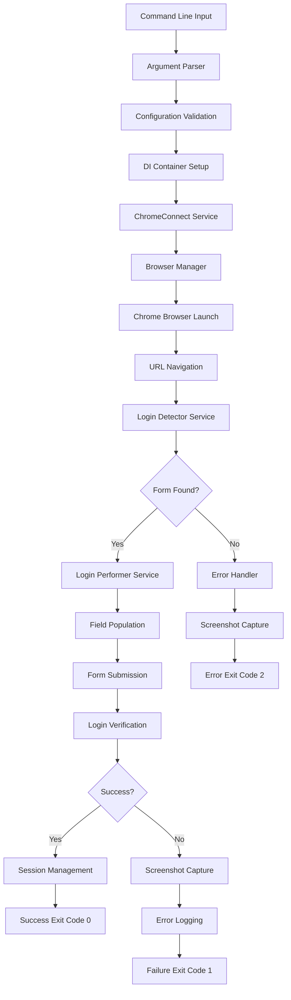

# ChromeConnect Architecture Overview

This document provides a comprehensive overview of ChromeConnect's architecture, design patterns, and technical implementation.

## 📋 Table of Contents

- [System Overview](#system-overview)
- [High-Level Architecture](#high-level-architecture)
- [Core Components](#core-components)
- [Data Flow](#data-flow)
- [Service Layer](#service-layer)
- [Models and DTOs](#models-and-dtos)
- [Exception Handling](#exception-handling)
- [Configuration Management](#configuration-management)
- [Logging and Monitoring](#logging-and-monitoring)
- [Security Considerations](#security-considerations)
- [Extension Points](#extension-points)
- [Technology Stack](#technology-stack)

---

## 🔍 System Overview

ChromeConnect is a console application built on .NET 8.0 that automates web browser interactions for authentication purposes. The application uses a modular, service-oriented architecture with clear separation of concerns.

### Design Principles

- **Single Responsibility**: Each component has a focused, well-defined purpose
- **Dependency Injection**: Loose coupling through DI container
- **Separation of Concerns**: Clear boundaries between layers
- **Error Resilience**: Comprehensive error handling and recovery
- **Extensibility**: Plugin-like architecture for future enhancements
- **Observability**: Detailed logging and monitoring capabilities

---

## 🏗️ High-Level Architecture

```
┌─────────────────────────────────────────────────────────────────┐
│                        ChromeConnect                            │
├─────────────────────────────────────────────────────────────────┤
│                     Presentation Layer                         │
│  ┌─────────────────┐  ┌─────────────────┐  ┌────────────────┐  │
│  │ Command Line    │  │ Configuration   │  │ Error Handler  │  │
│  │ Interface       │  │ Parser          │  │ & Exit Codes   │  │
│  └─────────────────┘  └─────────────────┘  └────────────────┘  │
├─────────────────────────────────────────────────────────────────┤
│                    Service Layer                               │
│  ┌─────────────────┐  ┌─────────────────┐  ┌────────────────┐  │
│  │ ChromeConnect   │  │ Login Detector  │  │ Login Performer│  │
│  │ Service         │  │ Service         │  │ Service        │  │
│  └─────────────────┘  └─────────────────┘  └────────────────┘  │
│  ┌─────────────────┐  ┌─────────────────┐  ┌────────────────┐  │
│  │ Session Manager │  │ Multi-Step      │  │ Popup/iFrame   │  │
│  │ Service         │  │ Navigator       │  │ Handler        │  │
│  └─────────────────┘  └─────────────────┘  └────────────────┘  │
│  ┌─────────────────┐  ┌─────────────────┐  ┌────────────────┐  │
│  │ JavaScript      │  │ Screenshot      │  │ Error Handler  │  │
│  │ Manager         │  │ Capture         │  │ Service        │  │
│  └─────────────────┘  └─────────────────┘  └────────────────┘  │
├─────────────────────────────────────────────────────────────────┤
│                      Core Layer                                │
│  ┌─────────────────┐  ┌─────────────────┐  ┌────────────────┐  │
│  │ Browser Manager │  │ Timeout Manager │  │ Constants &    │  │
│  │                 │  │                 │  │ Configuration  │  │
│  └─────────────────┘  └─────────────────┘  └────────────────┘  │
├─────────────────────────────────────────────────────────────────┤
│                   External Dependencies                        │
│  ┌─────────────────┐  ┌─────────────────┐  ┌────────────────┐  │
│  │ Selenium        │  │ WebDriverManager│  │ Chrome Browser │  │
│  │ WebDriver       │  │                 │  │ & ChromeDriver │  │
│  └─────────────────┘  └─────────────────┘  └────────────────┘  │
└─────────────────────────────────────────────────────────────────┘
```

---

## 🔧 Core Components

### Program.cs
**Purpose**: Application entry point and host configuration
**Responsibilities**:
- Command-line argument parsing
- Dependency injection container setup
- Host builder configuration
- Global exception handling
- Serilog configuration for single-file deployment

```csharp
// Simplified structure
public class Program
{
    public static async Task<int> Main(string[] args)
    {
        // Setup logging
        // Parse command line
        // Build host with DI
        // Execute main service
        // Handle exit codes
    }
}
```

### BrowserManager.cs
**Purpose**: Chrome browser lifecycle management
**Responsibilities**:
- Chrome browser instance creation and configuration
- WebDriver setup and initialization
- Browser option configuration (incognito, kiosk, certificates)
- Driver cleanup and disposal

**Key Methods**:
- `LaunchBrowser()`: Creates configured Chrome instance
- `SetupChromeDriver()`: Configures WebDriverManager
- `CloseBrowser()`: Proper browser cleanup

### ChromeConnectService.cs
**Purpose**: Main orchestration service
**Responsibilities**:
- Overall workflow coordination
- Service dependency management
- Error handling and recovery
- Result aggregation and reporting

**Workflow**:
1. Initialize browser session
2. Navigate to target URL
3. Detect login forms
4. Perform authentication
5. Verify success
6. Handle errors and cleanup

---

## 🌊 Data Flow

### 1. Application Startup
```
Command Line Args → Configuration Parser → DI Container → Host Builder → Main Service
```

### 2. Authentication Flow
```
URL Navigation → Form Detection → Field Population → Submission → Verification → Result
```

### 3. Error Handling Flow
```
Exception → Error Handler → Screenshot Capture → Logging → Cleanup → Exit Code
```

### Detailed Data Flow Diagram



---

## 🎯 Service Layer

### Core Services

#### ChromeConnectService
**Role**: Main orchestration and workflow management
**Dependencies**: All other services
**Key Responsibilities**:
- Coordinates the entire authentication process
- Manages service interactions
- Handles high-level error scenarios
- Provides unified interface for the application

#### LoginDetector
**Role**: Web form detection and analysis
**Dependencies**: WebDriver, TimeoutManager
**Detection Strategies**:
- Username field detection (multiple selectors)
- Password field detection
- Submit button identification  
- Form validation and structure analysis

**Supported Selectors**:
```csharp
// Username field patterns
"input[type='text']", "input[name*='user']", "input[id*='user']",
"input[name*='login']", "input[id*='login']", "input[name*='email']"

// Password field patterns  
"input[type='password']", "input[name*='pass']", "input[id*='pass']"

// Submit button patterns
"input[type='submit']", "button[type='submit']", "button"
```

#### LoginPerformer
**Role**: Form interaction and submission
**Dependencies**: WebDriver, TimeoutManager
**Capabilities**:
- Human-like typing simulation
- Field clearing and population
- Form submission handling
- JavaScript-based interactions

#### SessionManager
**Role**: Browser session persistence and management
**Features**:
- Session data storage (cookies, localStorage, sessionStorage)
- Session validation and health checks
- Automatic session recovery
- Secure credential handling

#### Multi-Step Navigator
**Role**: Complex multi-step login flows
**Capabilities**:
- State machine for step progression
- Configurable step definitions
- Retry logic and error recovery
- Dynamic step sequencing

#### Popup/iFrame Handler
**Role**: Window and frame context management
**Features**:
- Popup window detection and switching
- iFrame navigation and management
- Cross-domain context handling
- Automatic cleanup procedures

#### JavaScript Interaction Manager
**Role**: Advanced JavaScript-heavy page handling
**Capabilities**:
- Dynamic content wait strategies
- JavaScript execution helpers
- Shadow DOM support
- Event simulation and triggering

---

## 📊 Models and DTOs

### Configuration Models

#### CommandLineOptions
```csharp
public class CommandLineOptions
{
    [Option("USR", Required = true)] public string Username { get; set; }
    [Option("PSW", Required = true)] public string Password { get; set; }
    [Option("URL", Required = true)] public string Url { get; set; }
    [Option("DOM", Required = true)] public string Domain { get; set; }
    [Option("INCOGNITO", Required = true)] public bool Incognito { get; set; }
    [Option("KIOSK", Required = true)] public bool Kiosk { get; set; }
    [Option("CERT", Required = true)] public string Certificate { get; set; }
    [Option("debug")] public bool Debug { get; set; }
}
```

### Business Models

#### LoginFormElements
```csharp
public class LoginFormElements
{
    public IWebElement? UsernameField { get; set; }
    public IWebElement? PasswordField { get; set; }
    public IWebElement? DomainField { get; set; }
    public IWebElement? SubmitButton { get; set; }
    public bool IsValid => UsernameField != null && PasswordField != null;
}
```

#### LoginAttemptResult
```csharp
public class LoginAttemptResult
{
    public bool Success { get; set; }
    public string? ErrorMessage { get; set; }
    public string? ScreenshotPath { get; set; }
    public TimeSpan Duration { get; set; }
    public LoginFormElements? FormElements { get; set; }
}
```

### Advanced Models

The application includes sophisticated models for:
- **Multi-step login flows**: Step definitions, state tracking, execution results
- **Session management**: Session data, validation requests, recovery mechanisms
- **JavaScript interactions**: Wait conditions, execution requests, performance metrics
- **Popup/iFrame handling**: Context information, detection requests, operation results

---

## ⚠️ Exception Handling

### Exception Hierarchy

```csharp
public class ChromeConnectException : Exception
{
    public string? ScreenshotPath { get; set; }
    public string? Url { get; set; }
}

public class LoginFormNotFoundException : ChromeConnectException { }
public class LoginFailedException : ChromeConnectException { }
public class BrowserLaunchException : ChromeConnectException { }
public class NavigationException : ChromeConnectException { }
```

### Error Handling Strategy

1. **Layered Exception Handling**: Each layer handles its specific concerns
2. **Screenshot on Error**: Automatic capture for debugging
3. **Graceful Degradation**: Fallback strategies where possible
4. **Detailed Logging**: Comprehensive error information
5. **Clean Exit Codes**: Specific codes for different failure types

---

## ⚙️ Configuration Management

### Configuration Sources (Priority Order)

1. **Command-line arguments** (highest priority)
2. **Environment variables**
3. **appsettings.json**
4. **Default values** (lowest priority)

### Configuration Structure

```json
{
  "Logging": {
    "LogLevel": {
      "Default": "Information",
      "Microsoft": "Warning",
      "System": "Warning"
    }
  },
  "ChromeConnect": {
    "DefaultTimeout": 30,
    "MaxRetryAttempts": 3,
    "ScreenshotOnError": true,
    "LoggingLevel": "Information",
    "BrowserOptions": {
      "DefaultWindowSize": "1280x1024",
      "PageLoadTimeout": 30,
      "ImplicitWaitTimeout": 10
    }
  }
}
```

---

## 📊 Logging and Monitoring

### Logging Framework: Serilog

**Structured Logging**: JSON-formatted logs with contextual data
**Multiple Sinks**: Console and file outputs
**Log Levels**: Debug, Information, Warning, Error, Fatal
**Performance Metrics**: Request duration, success rates

### Log Structure Example

```json
{
  "@timestamp": "2024-11-23T10:30:45.123Z",
  "@level": "Information",
  "@message": "Login attempt started",
  "Username": "john.doe",
  "Url": "https://portal.company.com",
  "Domain": "CORPORATE",
  "SessionId": "abc123",
  "Duration": "00:00:02.345"
}
```

### Monitoring Capabilities

- **Performance Tracking**: Login duration and success rates
- **Error Correlation**: Link errors with specific user sessions
- **Screenshot Integration**: Automatic capture paths in logs
- **Browser Metrics**: Memory usage and resource consumption

---

## 🔒 Security Considerations

### Credential Handling

- **Memory Protection**: Passwords cleared after use
- **Log Masking**: Automatic password redaction in logs
- **Process Security**: Passwords not visible in process lists
- **Secure Storage**: No permanent credential storage

### Browser Security

- **Incognito Mode**: Recommended for sensitive operations
- **Certificate Validation**: Configurable SSL/TLS handling
- **Sandbox Mode**: Chrome runs in sandboxed environment
- **No Extensions**: Disabled to prevent interference

### Data Protection

- **Screenshot Sanitization**: Sensitive data blurred
- **Log Retention**: Configurable log cleanup
- **Memory Management**: Secure memory deallocation
- **Temporary Files**: Automatic cleanup

---

## 🔌 Extension Points

### Plugin Architecture

ChromeConnect supports extensions through:

1. **Custom Login Detectors**: Implement `ILoginDetector`
2. **Authentication Strategies**: Implement `ILoginPerformer`
3. **Session Handlers**: Implement `ISessionManager`
4. **Error Handlers**: Implement `IErrorHandler`

### Extension Example

```csharp
public class CustomLoginDetector : ILoginDetector
{
    public async Task<LoginFormElements?> DetectLoginFormAsync(
        IWebDriver driver, 
        CancellationToken cancellationToken)
    {
        // Custom implementation for specific site
        return new LoginFormElements();
    }
}

// Registration in DI
services.AddScoped<ILoginDetector, CustomLoginDetector>();
```

---

## 🛠️ Technology Stack

### Core Technologies

| Component | Technology | Version | Purpose |
|-----------|------------|---------|---------|
| **Runtime** | .NET | 8.0 | Application platform |
| **Language** | C# | 12.0 | Primary development language |
| **Web Automation** | Selenium WebDriver | 4.x | Browser automation |
| **Driver Management** | WebDriverManager.Net | Latest | Automatic driver downloads |
| **Logging** | Serilog | 3.x | Structured logging |
| **DI Container** | Microsoft.Extensions.DI | 8.0 | Dependency injection |
| **Configuration** | Microsoft.Extensions.Configuration | 8.0 | Configuration management |
| **CLI Parsing** | CommandLineParser | 2.x | Command-line argument parsing |

### Development Tools

- **IDE**: Visual Studio 2022 / VS Code
- **Build System**: .NET CLI / MSBuild
- **Package Manager**: NuGet
- **Version Control**: Git
- **Deployment**: Self-contained executable

### Runtime Dependencies

- **Chrome Browser**: Latest stable version
- **ChromeDriver**: Auto-downloaded by WebDriverManager
- **Windows OS**: Windows 7 SP1+ (x64)
- **.NET Runtime**: Included in self-contained deployment

---

## 📈 Performance Considerations

### Optimization Strategies

1. **Lazy Loading**: Services instantiated on demand
2. **Connection Pooling**: Reuse browser sessions where possible
3. **Memory Management**: Explicit disposal and garbage collection
4. **Async Operations**: Non-blocking I/O operations
5. **Resource Cleanup**: Automatic browser and driver cleanup

### Performance Metrics

- **Startup Time**: ~2-5 seconds (including Chrome launch)
- **Login Duration**: ~5-15 seconds (depends on site)
- **Memory Usage**: ~100-200 MB (including Chrome)
- **Binary Size**: ~40-50 MB (self-contained)

---

## 🔄 Future Architecture Considerations

### Scalability

- **Headless Mode**: For server environments
- **Parallel Execution**: Multiple concurrent sessions
- **Containerization**: Docker support
- **Cloud Deployment**: Azure/AWS compatibility

### Extensibility

- **Plugin System**: Dynamic module loading
- **API Interface**: REST/gRPC endpoints
- **Configuration UI**: Web-based configuration
- **Reporting System**: Enhanced analytics and reporting

---

## 📞 Developer Resources

- **Source Code**: [GitHub Repository](https://github.com/yourorg/chromeconnect)
- **API Documentation**: [API Reference](api-reference.md)
- **Development Guide**: [Contributing Guide](../CONTRIBUTING.md)
- **Architecture Decisions**: [ADR Documents](../docs/adr/)

---

*This architecture documentation is maintained as part of the ChromeConnect project. Last updated: November 2024* 